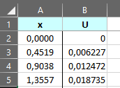

[Home](./) &nbsp;&nbsp;&nbsp;&nbsp;  [About](./about.html) &nbsp;&nbsp;&nbsp;&nbsp; [Vibração em passarelas](./documentation.html)

# Dinâmica de passarelas 

- ## Propósito

Realizar a análise dinâmica de passarelas para um modo de vibrar previamente definido. Para o carregamento dinâmico atuante   sobre a passarela é considerado o modelo sugerido pelo Guia Sétra para a Classe 1 que representa passarelas em regiões  urbanas com grande tráfego de pedestres.

.

>

.

- ## Guia de utilização

### 1. Planilha com deslocamentos do modo a ser analisado

Planilha contendo coordenadas ao longo da passarela com os respectivos deslocamentos do modo e na direção de vibração em análise. A coluna de posição deve ser nomeada por "x" ou "X" e a coluna de deslocamentos por "u" ou "U" assim como está representado na imagem abaixo.

### 2. Input

Importe a planilha do item 1 e preencha os demais campos. Use valores no SI.

### 3. Configurações da análise

No menu há uma seção de configurações. Nela é possível alterar o número de pontos de Gauss que será usado nas integrações numéricas, o tempo inicial e final da análise e o número de intervalos para a resolução da equação diferencial da dinâmica para o problema. Esses valores devem ser ajustados conforme a análise.

### 4. Output

Ao clicar em "Go" a análise será iniciada. Ao ser finalizada serão mostradas as propriedades dinâmicas da passarela e as respostas no domínio do tempo, assim como alguns resultados em coordenadas geométricas.

- ## Etapas da análise

### 1. Obtenção dos pontos da função autovetor (Φ)

Os dados de deslocamentos importados da planilha são normalizados (divididos pelo maior valor) e deslocados para que o menor valor em módulo se torne zero (representando um apoio). Então, é feita uma interpolação utilizando o método de Newton para se obter o valor de Φ para qualquer posição ao longo da passarela.

### 2. Cálculo da massa, rigidez e força modais

##### Para o cálculo da massa modal foi utilizada a equação abaixo

`L : Comprimento da passarela`

`Mlinear: Massa por unidade de comprimento`

`Φ: Função autovetor do modo em análise`

##### Para o cálculo da rigidez modal foi utilizada a equação abaixo

`ω : Frequência angular do modo natural de vibração estudado`

##### Para o cálculo da força modal foi utilizada a equação abaixo

`D : Largura da passarela`

`L : Comprimento da passarela`

`P : Modelo matemático que representa a ação dinâmica do caminhar humano`

`Φ: Função autovetor do modo em análise`

##### O modelo matemático representado por P é definido pelo Guia Sétra como:

- ##### Para o primeiro harmônico do caminhar humano:

`d : Densidade de pessoas na passarela`

`f : frequência natural do modo anlisado`

`n : Número de pessoas na passrela`

`Ψ : Fator de minoração que leva em conta a probabilidade de ocorrer ressonância`

- ##### Para o segundo harmônico do caminhar humano:

>Todas as integrações foram realizadas através da Quadratura de Gauss-Legendre

### 3. Resolução da equação diferencial geral da dinâmica

##### A equação a ser resolvida está representada abaixo

`m : Massa modal`

`ξ : Taxa de amortecimento`

`ω : Frequência angular do modo natural de vibração`

`k : Rigidez modal`

`F : Força modal`

##### A resolução é feita através do método numérico Runge-Kutta. Mais especificamente o RK4, que é o Runge-Kutta de 4° ordem. Para isso a equação geral da dinâmica de 2° ordem é reduzida em duas equações diferenciais de 1° ordem, gerando o sistema representado abaixo

> Para dúvidas ou sugestões entre em contado com `rafa10031999@gmail.com`
